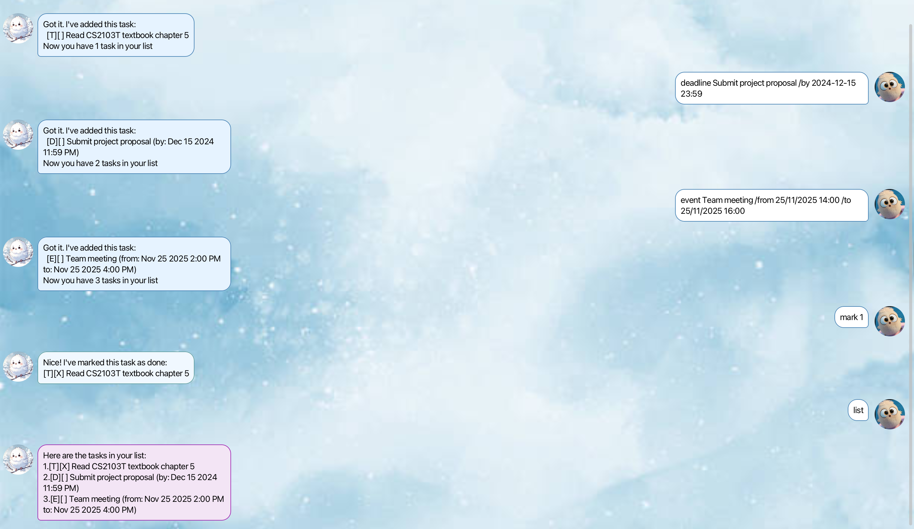

# Snow User Guide



Snow is a friendly task management chatbot that helps you organize your daily activities. Whether you need to track simple todos, important deadlines, or scheduled events, Snow has got you covered! With its intuitive chat interface and winter-themed design, managing your tasks has never been more delightful.

## Quick Start

1. Download the latest `snow.jar` from the [releases page](https://github.com/Duyy0406/ip/releases)
2. Double-click the file to launch Snow
3. Start chatting with Snow to manage your tasks!

## Features

### Adding a Todo Task: `todo`

Add a simple task to your list.

**Format:** `todo DESCRIPTION`

**Example:** 
```
todo Read CS2103T textbook chapter 5
```

**Expected output:**
```
Got it. I've added this task:
  [T][ ] Read CS2103T textbook chapter 5
Now you have 1 task in your list
```

### Adding a Deadline: `deadline`

Add a task with a specific due date and time.

**Format:** `deadline DESCRIPTION /by DATE TIME`

**Date formats supported:**
- `YYYY-MM-DD HH:MM` (e.g., 2024-12-15 23:59)
- `DD/MM/YYYY HH:MM` (e.g., 15/12/2024 23:59)

**Example:** 
```
deadline Submit project proposal /by 2024-12-15 23:59
```

**Expected output:**
```
Got it. I've added this task:
  [D][ ] Submit project proposal (by: Dec 15 2024 11:59 PM)
Now you have 2 tasks in your list
```

### Adding an Event: `event`

Add a task that spans a specific time period.

**Format:** `event DESCRIPTION /from START_TIME /to END_TIME`

**Example:** 
```
event Team meeting /from 2024-11-25 14:00 /to 2024-11-25 16:00
```

**Expected output:**
```
Got it. I've added this task:
  [E][ ] Team meeting (from: Nov 25 2024 2:00 PM to: Nov 25 2024 4:00 PM)
Now you have 3 tasks in your list
```

### Viewing All Tasks: `list`

Display all tasks in your list.

**Format:** `list`

**Example:** 
```
list
```

**Expected output:**
```
Here are the tasks in your list:
1. [T][ ] Read CS2103T textbook chapter 5
2. [D][ ] Submit project proposal (by: Dec 15 2024 11:59 PM)
3. [E][ ] Team meeting (from: Nov 25 2024 2:00 PM to: Nov 25 2024 4:00 PM)
```

### Marking Tasks as Done: `mark`

Mark a task as completed.

**Format:** `mark INDEX`

**Example:** 
```
mark 1
```

**Expected output:**
```
Nice! I've marked this task as done:
  [T][X] Read CS2103T textbook chapter 5
```

### Unmarking Tasks: `unmark`

Mark a completed task as not done.

**Format:** `unmark INDEX`

**Example:** 
```
unmark 1
```

**Expected output:**
```
OK, I've marked this task as not done yet:
  [T][ ] Read CS2103T textbook chapter 5
```

### Deleting Tasks: `delete`

Remove a task from your list.

**Format:** `delete INDEX`

**Example:** 
```
delete 2
```

**Expected output:**
```
Noted. I've removed this task:
  [D][ ] Submit project proposal (by: Dec 15 2024 11:59 PM)
Now you have 2 tasks in your list
```

### Finding Tasks: `find`

Search for tasks containing specific keywords.

**Format:** `find KEYWORD`

**Example:** 
```
find meeting
```

**Expected output:**
```
Here are the matching tasks in your list:
1. [E][ ] Team meeting (from: Nov 25 2024 2:00 PM to: Nov 25 2024 4:00 PM)
```

### Finding Tasks by Date: `findbydate`

Find all tasks scheduled for a specific date.

**Format:** `findbydate DATE`

**Example:** 
```
findbydate 2024-11-25
```

**Expected output:**
```
Here are the tasks on 2024-11-25:
1. [E][ ] Team meeting (from: Nov 25 2024 2:00 PM to: Nov 25 2024 4:00 PM)
```

### Adding Location to Tasks: `/at`

You can specify a location for any task by adding `/at LOCATION` to the description.

**Examples:**
```
todo Buy groceries /at Cold Storage
deadline Submit assignment /by 2024-12-01 23:59 /at School
event Conference /from 2024-12-10 09:00 /to 2024-12-10 17:00 /at Marina Bay Sands
```

### Managing Places: `places`

View all locations you've used in your tasks.

**Format:** `places`

**Example output:**
```
Places you've been to:
1. Cold Storage
2. School  
3. Marina Bay Sands
```

### Exiting the Application: `bye`

Close Snow and save your tasks.

**Format:** `bye`

**Expected output:**
```
Bye. Hope to see you again soon!
```

## Task Status Symbols

- `[T]` - Todo task
- `[D]` - Deadline task  
- `[E]` - Event task
- `[ ]` - Not completed
- `[X]` - Completed

## Data Storage

Snow automatically saves your tasks to a file called `data/snow.txt`. Your tasks will be preserved between sessions, so you don't have to worry about losing your data!

## Tips

1. **Use descriptive task names** - This makes it easier to find tasks later
2. **Set realistic deadlines** - Snow will help you stay organized 
3. **Use the find feature** - Quickly locate specific tasks
4. **Add locations** - Keep track of where you need to be
5. **Regular cleanup** - Delete completed tasks that you no longer need to track

## Troubleshooting

**Q: Snow won't start**  
A: Make sure you have Java 11 or later installed on your system.

**Q: My tasks disappeared**  
A: Check if the `data/snow.txt` file exists in the same folder as the Snow application.

**Q: Date format not recognized**  
A: Use the supported formats: `YYYY-MM-DD HH:MM` or `DD/MM/YYYY HH:MM`

**Q: Can't find a task**  
A: Use the `find` command with keywords from the task description.

---

*Happy task managing with Snow! ❄️*